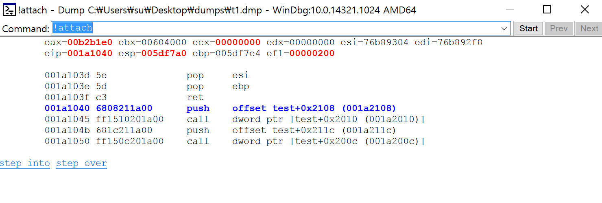
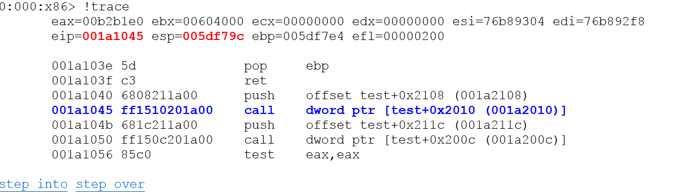
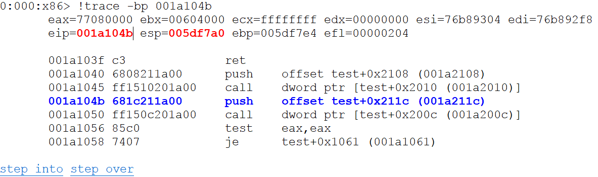
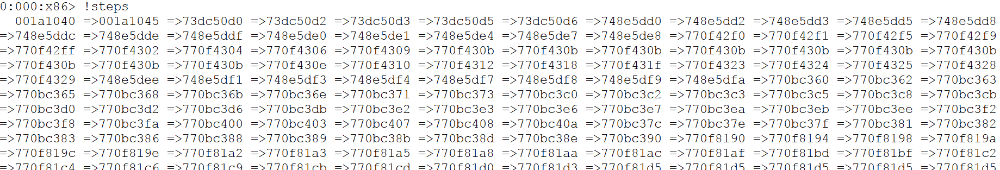
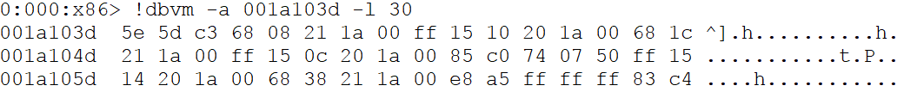
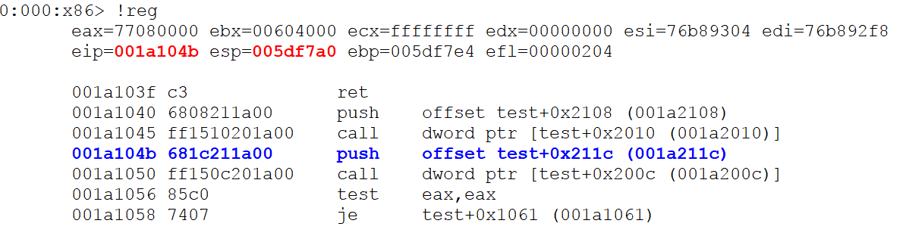

Pegasus project
==============
*  *windbg emulation plugin*
*  *anti anti reversing plugin for windbg*

Engine
-------
* unicorn : https://github.com/unicorn-engine/unicorn
* distorm : https://github.com/gdabah/distorm

Build
-------

Support
-------

Video
-------
*  https://goo.gl/TBNaHf
* 

Screenshot
-------

Commands
-------
<pre>
0:000> .load pegasus.dll
*****************************************************
*                                                   *
*         PEGASUS - Windbg emulation plugin         *
*                                                   *
*****************************************************

0:000> !attach -?
; 0:000> !attach command attached the current target application to the emulator.

0:000> !detach -?
; 0:000> !detach command detached the current target application to the emulator.

0:000> !trace -?
; !trace [/so] [/bp <bp>]
;  /bp - break point. (space-delimited)
;  /so - step over.
; 0:000> !trace command executes a single instruction.

0:000> !steps -?
; 0:000> !steps command displays the trace step.

0:000> !dbvm -?
; !dbvm [/a <a>] [/l <l>]
;  /a <a> - address (space-delimited)
;  /l <l> - length (space-delimited)
; 0:000> !dbvm commands display the contents of memory in the given range.

0:000> !regs -?
; 0:000> !reg command displays current registers.
</pre>
